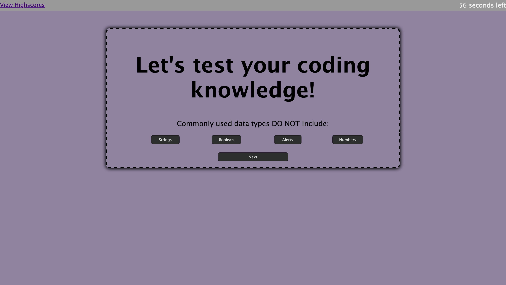

# TestTime09

For this assignment I made a interactive quiz with a built-in timer.

The technologies used in this homework were as follows:
HTML
CSS
Javascript

The requirements were:
WHEN I click the start button.
THEN a timer starts and I am presented with a question.
WHEN I answer a question.
THEN I am presented with another question.
WHEN I answer a question incorrectly.
THEN time is subtracted from the clock.
WHEN all questions are answered or the timer reaches 0.
THEN the game is over.
WHEN the game is over.
THEN I can save my initials and my score.

The main challenges I faced with this assignment were:

1. Stopping the timer when the user reached the end of the quiz.
2. Usig quiz time as form of keeping score.
3. Getting the local storage to display on the webpage.

I was able to get the user initials and user score on the score board, but since the users score is dependent on the timer which doesnt stop at the end of the quiz the scores recorded end up being inaccurate.

